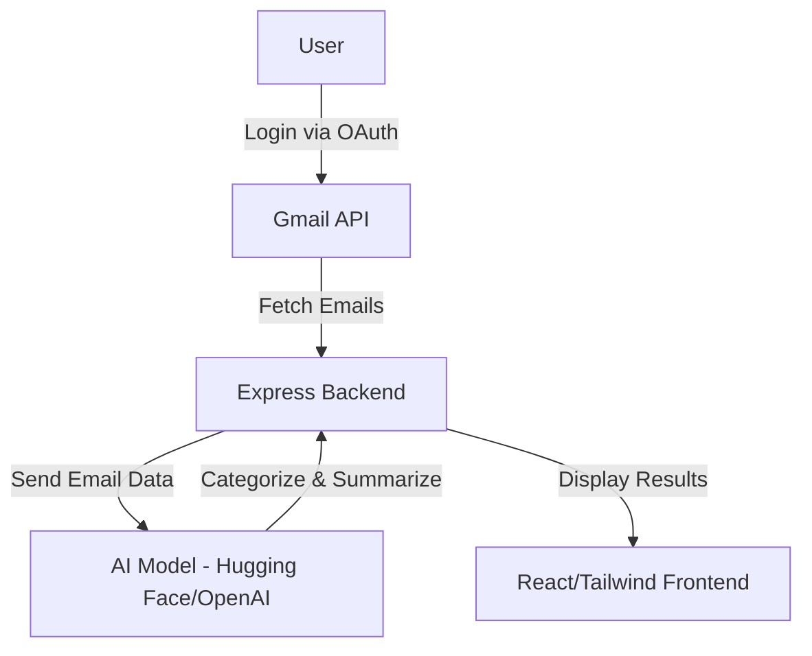

# 📧 AI Gmail Analyzer

Transform your Gmail into an intelligent assistant that helps you manage freelancing emails, never miss opportunities, and stay organized with AI-powered insights.

---

## 🎯 Features

- **Smart Email Analysis** – Categorizes emails as client work, job opportunities, payments, meetings, etc.
- **Intelligent Summaries** – Concise summaries with actionable insights and tips.
- **Priority Detection** – Automatically identifies urgent emails from freelancing platforms.
- **Pattern Analysis** – Insights about your email habits with recommendations.
- **Actionable Tips** – Personalized advice for each email based on freelancing context.

---

## 📋 Prerequisites

- **Node.js 18+** – [Download here](https://nodejs.org/)
- **Gmail Account** – The one you want to manage.
- **Google Cloud Account** – Free tier is sufficient.

---

## 🚀 Quick Start (5 Minutes)

### 1. Clone and Install

```bash
git clone https://github.com/vedant-vijay/AI-Gmail-Analyzer.git
cd AI-Gmail-Analyzer
npm install
```

### 2. Google Cloud Setup

- Go to [Google Cloud Console](https://console.cloud.google.com/)
- Create new project: **AI Email Assistant**
- Enable Gmail API:
  - Search for "Gmail API"
  - Click "Enable"
- Create OAuth2 credentials:
  - Type: Web application
  - Redirect URI: `http://localhost:8080/api/auth/google/callback`
  - Download the JSON file

### 3. Environment Setup

Create a `.env` file in the project root:

```env
GOOGLE_CLIENT_ID=your_client_id_here
GOOGLE_CLIENT_SECRET=your_client_secret_here
GOOGLE_REDIRECT_URI=http://localhost:8080/api/auth/google/callback
JWT_SECRET=your_super_secret_jwt_key_here

# Optional AI Keys
OPENAI_API_KEY=your_openai_key_here
HUGGINGFACE_API_KEY=your_huggingface_key_here

PING_MESSAGE=AI Email Assistant is running!
```

### 4. Start the Application

```bash
npm run dev
```

Open [http://localhost:8080](http://localhost:8080) and sign in with your Gmail account.

---

## 🔧 Detailed Configuration

### Google Cloud Console Setup

- Create Project – **AI Email Assistant**
- Enable Gmail API
- Configure OAuth Consent Screen
  - App Name: AI Email Assistant
  - Add scopes:
    ```
    https://www.googleapis.com/auth/gmail.readonly
    https://www.googleapis.com/auth/userinfo.email
    https://www.googleapis.com/auth/userinfo.profile
    ```
- Create OAuth2 Credentials
  - JavaScript Origins: `http://localhost:8080`
  - Redirect URIs: `http://localhost:8080/api/auth/google/callback`

---

## 🤖 AI Integration

- **Option 1 – OpenAI (Best Quality)**
  - Create account → Generate API Key
  - Add to `.env` → `OPENAI_API_KEY=...`
- **Option 2 – Hugging Face (Free Tier)**
  - Create account → Access Tokens → New Token
  - Add to `.env` → `HUGGINGFACE_API_KEY=...`
- **Option 3 – No AI**
  - Falls back to rule-based analysis.

---

## 🏗️ Project Structure

```
AI-Gmail-Analyzer/
├── client/          # React frontend
├── server/          # Express backend
├── shared/          # Shared types
├── .env
└── package.json
```

---

## 🔌 API Endpoints

**Auth**
- `GET /api/auth/google`
- `GET /api/auth/google/callback`
- `POST /api/auth/verify`
- `POST /api/auth/logout`

**Email Operations**
- `GET /api/emails` – All emails w/ AI analysis
- `GET /api/emails/important` – High-priority only
- `GET /api/emails/search?q=keyword`
- `GET /api/emails/insights`

---

## 🎨 Frontend Features

- Email Cards with AI summaries, tags, and action items
- Smart Filters (All, Important, Unread)
- Search with instant results
- Stats Panel with key metrics
- AI Insights with recommendations

---

## 🔐 Security & Privacy

- OAuth2 secure authentication
- Read-only Gmail access
- No email storage
- Local real-time processing

---

## 🚀 Deployment Options

- Local Development – `npm run dev`
- Render / Vercel / Railway – Free-tier supported

---

## 🛠️ Troubleshooting

- **403 Access Denied** → Configure OAuth Consent Screen
- **Redirect URI mismatch** → Ensure exact match in Google Cloud settings
- **AI not working** → Add `OPENAI_API_KEY` or `HUGGINGFACE_API_KEY`

---

## 📊 AI Categories & Urgency Levels

**Categories:**  
`client_work`, `job_opportunity`, `payment`, `meeting`, `marketing`, `personal`, `other`

**Urgency:**  
`Critical` | `High` | `Medium` | `Low`

---

## 🔄 Development

```bash
npm run dev          # Dev mode
npm run build        # Production build
npm test             # Run tests
npm run typecheck    # TypeScript check
```

---

## 🤝 Contributing

1. Fork the repo
2. Create feature branch: `git checkout -b feature/amazing-feature`
3. Commit: `git commit -m 'Add amazing feature'`
4. Push & open PR


---

## 🙏 Acknowledgments

- Gmail API – Email access
- OpenAI – AI analysis
- Hugging Face – Free AI models
- React + Express – Full-stack foundation
- Tailwind CSS – Styling

---

🚀 **Ready to transform your email workflow? Clone the repo and start today!**

---

## 📊 Architecture Diagram

